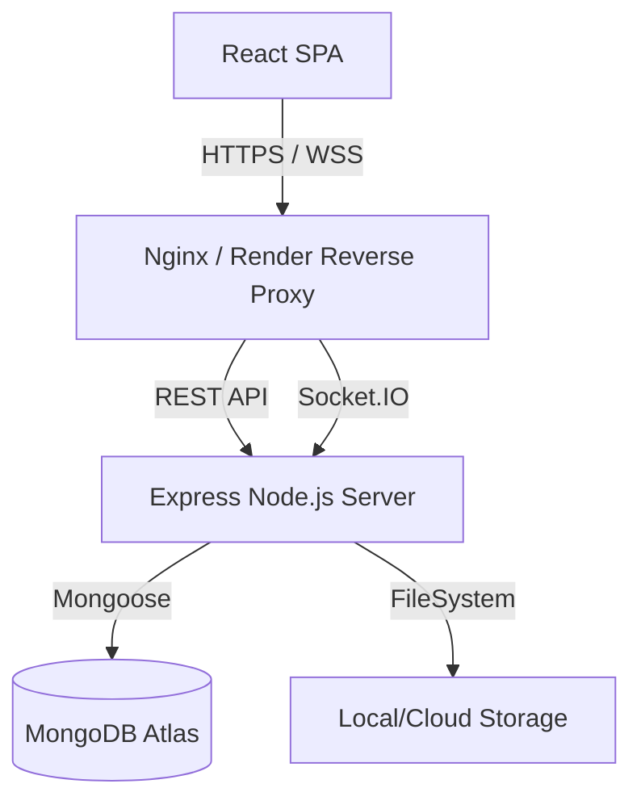
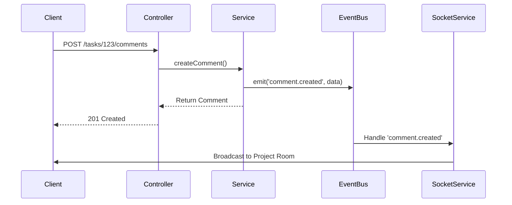
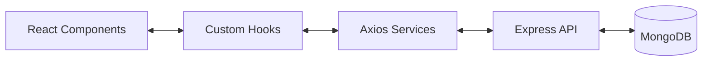

# Architecture Overview

TeamFlow is architected as a **Modular Monolith**. This approach provides the simplicity and deployment ease of a monolithic architecture, combined with the domain separation and maintainability of microservices.

## High-Level Architecture

## Backend Architecture

The backend follows a strictly layered, domain-oriented structure.

1. **Routing Layer (`/api/v1`)**: Registers middleware and delegates to controllers.
2. **Controller Layer**: Handles HTTP requests, extracts parameters, and formulates responses. Should contain NO business logic.
3. **Service Layer**: Contains all core business logic, permissions checks, and complex orchestrations.
4. **Data Access Layer (Models)**: Mongoose schemas wrapping MongoDB collections.

### EventBus & Real-time Flow

To decouple domain boundaries, TeamFlow uses an internal asynchronous `EventBus` combined with Socket.IO for real-time client updates.

## Frontend Architecture

The frontend is a React 19 Single Page Application (SPA) utilizing Vite for lightning-fast HMR and optimized builds.

- **Routing**: `react-router-dom` v7 manages client-side navigation.
- **State Management**: React Context handles global state (Auth, Theme). Component-level state utilizes hooks (`useState`, `useReducer`).
- **Styling**: Tailwind CSS v4 provides atomic utility classes ensuring consistent, scalable design tokens without stylesheet bloat.
- **Network**: `Axios` manages HTTP REST calls with interceptors for JWT injection and transparent token refreshing. `socket.io-client` handles real-time bidirectional events.

## Data Flow

