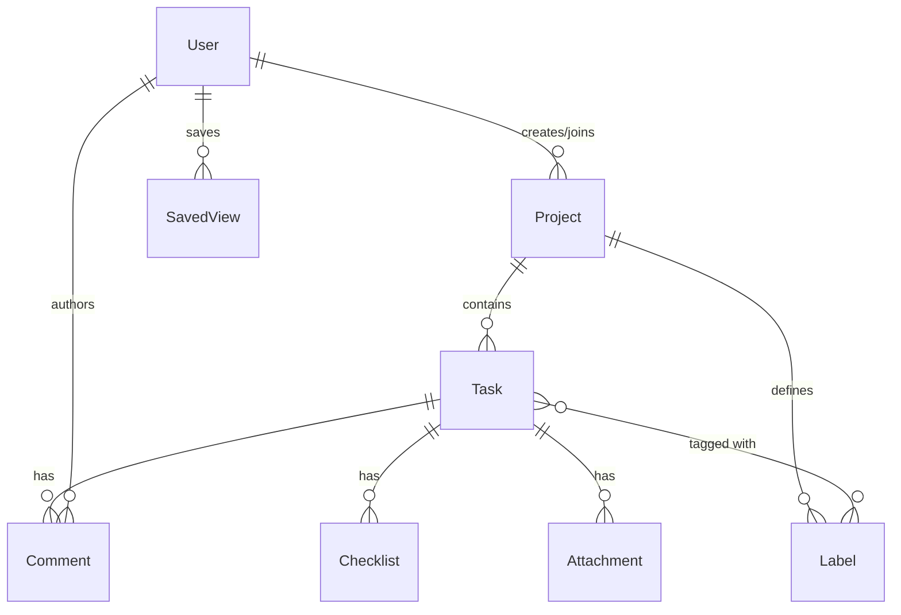

# Database Documentation

TeamFlow uses MongoDB, a NoSQL document database, orchestrated via Mongoose ORM.

## Entity Relationship Diagram

## Collections Overview

| Collection | Purpose |
|------------|---------|
| `users` | Stores account credentials (hashed passwords), RBAC roles, and profiles. |
| `projects` | High-level containers defining access boundaries and workspaces. |
| `tasks` | The core domain entity representing work items (Kanban cards). |
| `comments` | Threaded discussions attached to specific tasks. |
| `checklists` | Sub-task arrays embedded or referenced against tasks. |
| `labels` | Project-scoped taxonomy tags for filtering tasks. |
| `attachments`| Metadata regarding files uploaded to tasks. |
| `activities` | Immutable audit log of all system actions for historical timelines. |
| `saved_views`| User-specific personalized JSON filter configurations. |

## Query Strategy & Indexes

To maintain performance at scale, TeamFlow implements strict indexing strategies:

- **Tasks**: Compound indexes on `{ project: 1, status: 1 }` to quickly load Kanban boards.
- **Search**: `Text` indexes across `Task.title`, `Task.description`, and `Project.name` to power the Global Search command palette.
- **History/Activities**: Indexed by `{ project: 1, createdAt: -1 }` for rapid timeline pagination.
- **Foreign Keys**: All Mongoose `ObjectId` references utilized in `$lookup` or `.populate()` are inherently indexed.

*Note: Avoid unbounded `.populate()` calls on arrays that can grow infinitely (e.g., Activity Logs). Always use pagination (limit/skip).*
