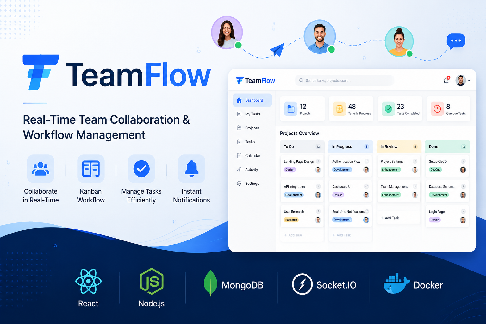
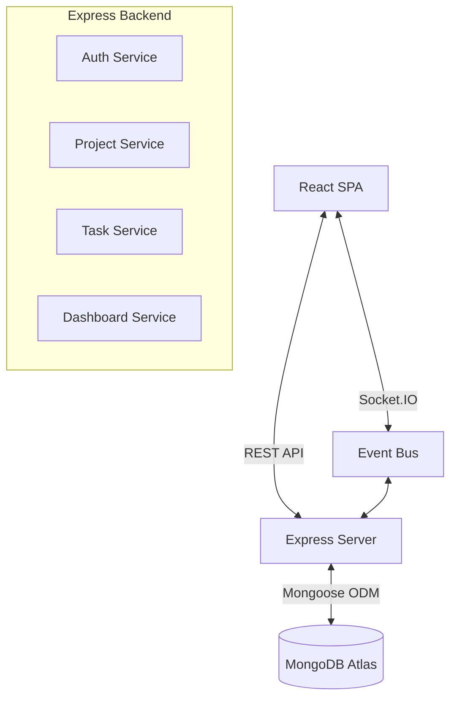
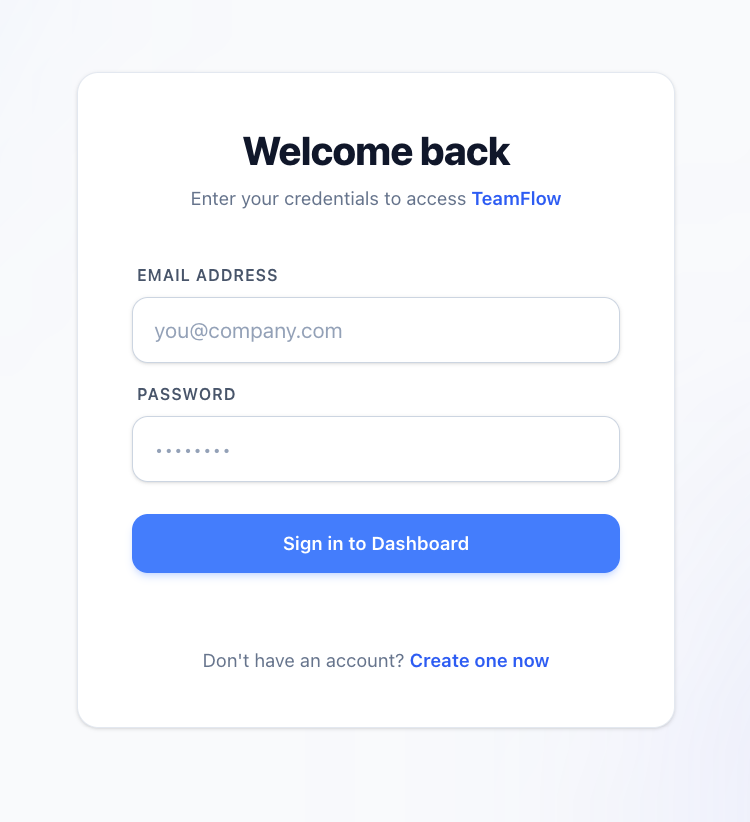
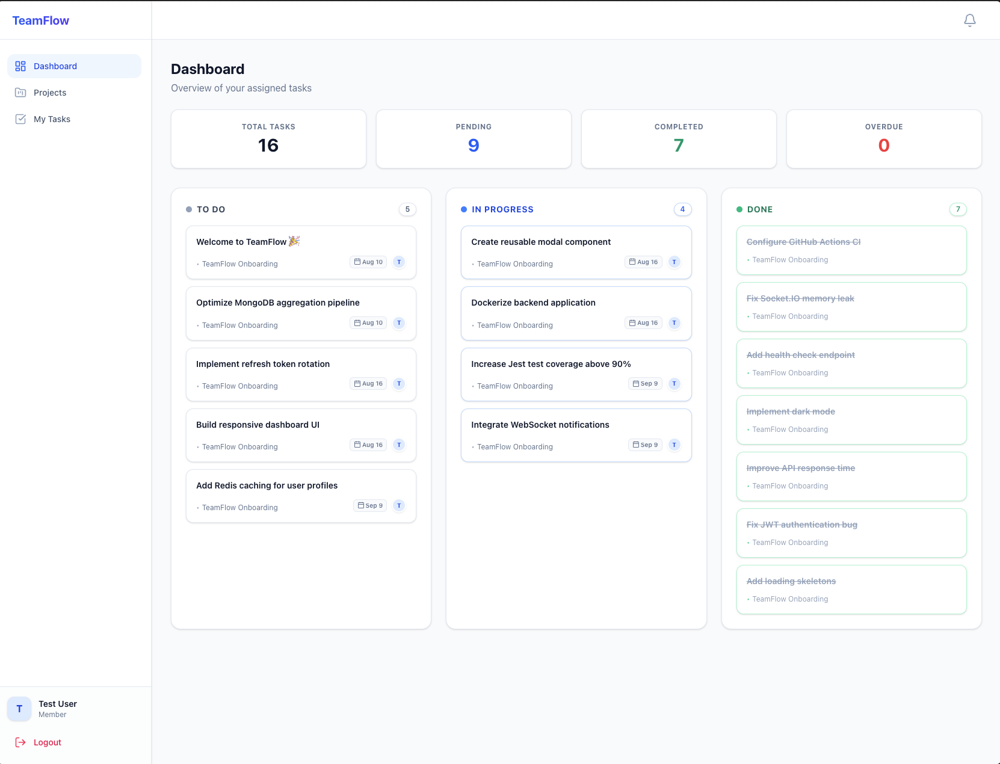
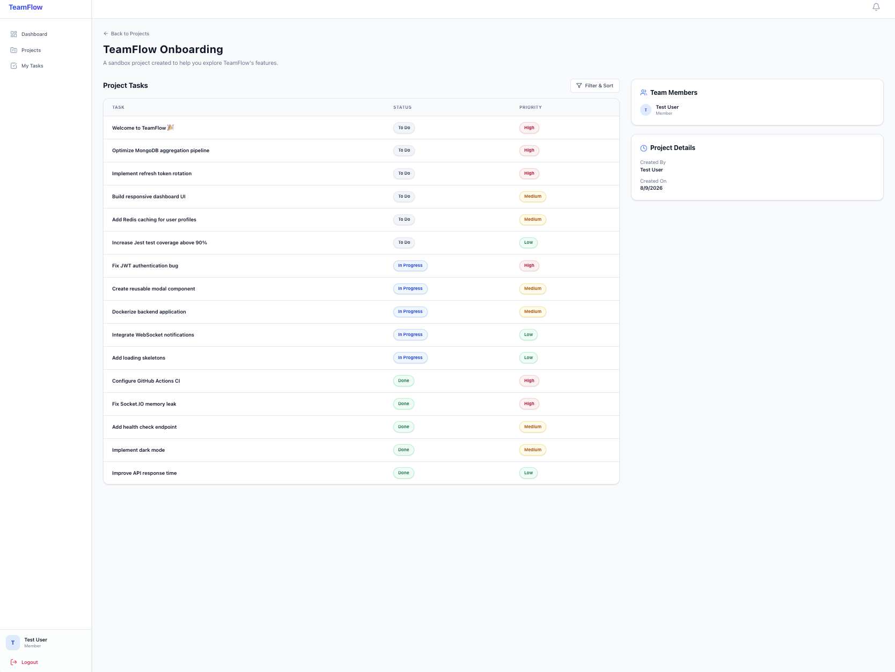
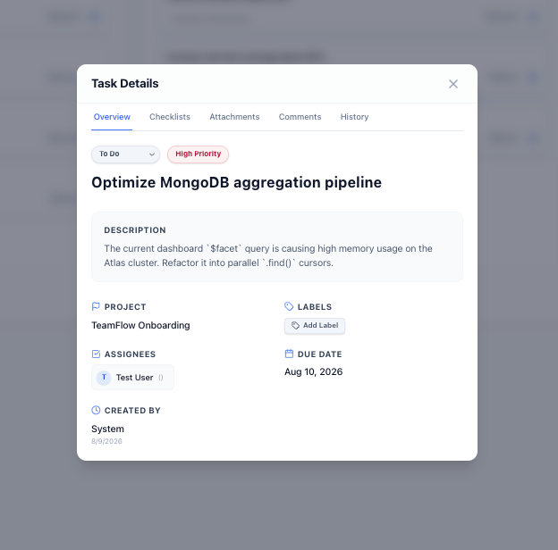
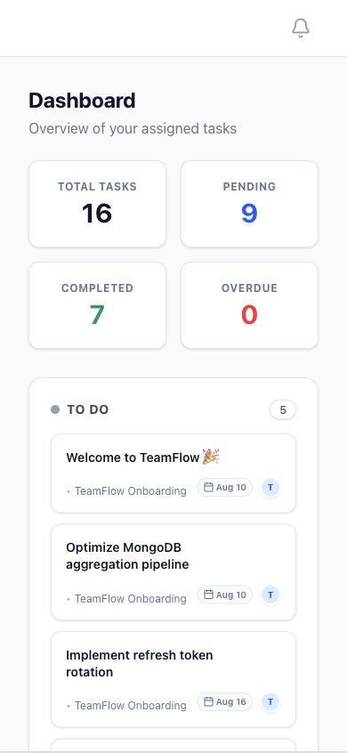

# TeamFlow

<p align="center">
  
</p>

## Project Overview

TeamFlow is a full-stack, production-ready MERN web application engineered for collaborative teams. Inspired by industry-leading tools like Jira and Linear, TeamFlow delivers a highly responsive, real-time environment for managing projects, assigning tasks, and maintaining team productivity.

It features strict Role-Based Access Control (RBAC), real-time WebSocket notifications, dynamic multi-user assignments, and a lightning-fast Kanban-style dashboard.

## Features

- **Authentication & RBAC**: Secure JWT-based authentication with distinct Admin and Member roles.
- **My Tasks Dashboard**: A personalized, scalable dashboard categorizing tasks into Assigned, In Progress, Overdue, and Completed.
- **Projects & Kanban**: Create projects, manage tasks via Kanban boards, set priorities, and assign team members.
- **Real-Time Collaboration**: Instant Socket.IO synchronization for task updates, live comments, and notifications.
- **Rich Task Details**: Comprehensive support for labels, sub-checklists, attachments, and rich-text activity history.
- **Global Search**: Advanced `Meta+K` command palette for instantaneous cross-project querying.
- **Automated Onboarding**: Zero-configuration demo seeder safely provisions realistic onboarding tasks for new users.

## Architecture

TeamFlow is built as a **Modular Monolith**, prioritizing domain-driven design, robust service boundaries, and performance.



## Technology Stack

**Frontend**
- React 19 + Vite 8
- Tailwind CSS v4
- React Router v7
- Axios
- Lucide Icons

**Backend**
- Node.js + Express 5
- MongoDB Atlas + Mongoose 9
- Socket.IO
- JWT (JSON Web Tokens)
- Pino (Structured Logging)

**DevOps & Testing**
- Docker & Docker Compose
- GitHub Actions CI/CD
- Jest (Backend Integration)
- Vitest + RTL (Frontend Unit)
- Playwright (End-to-End)

## 📸 Screenshots

<details>
<summary><b>🔐 Login Screen</b></summary>

<p align="center">
  
</p>

</details>

<details>
<summary><b>📊 Dashboard</b></summary>

<p align="center">
  
</p>

</details>

<details>
<summary><b>📁 Project Details</b></summary>

<p align="center">
  
</p>

</details>

<details>
<summary><b>📝 Task Details Modal</b></summary>

<p align="center">
  
</p>

</details>

<details>
<summary><b>📱 Mobile Responsive View</b></summary>

<p align="center">
  
</p>

</details>


## Folder Structure

```
teamflow/
├── client/           # React Frontend Application
│   ├── src/          # Source Code (Components, Pages, Context, Services)
│   ├── public/       # Static Assets
│   └── e2e/          # Playwright E2E Tests
├── server/           # Express Backend Application
│   ├── controllers/  # Route Handlers
│   ├── services/     # Core Business Logic
│   ├── models/       # Mongoose Schemas
│   ├── docs/         # OpenAPI/Swagger Specifications
│   └── __tests__/    # Jest Integration Tests
├── .github/          # GitHub Actions CI/CD Workflows
└── docker-compose.yml# Local Development & Orchestration
```

## Local Development

### Prerequisites
- Node.js (v22+)
- MongoDB (v7+) or Docker
- Git

### Setup Instructions

1. **Clone the repository:**
   ```bash
   git clone https://github.com/Akrishna4/teamflow.git
   cd teamflow
   ```

2. **Environment Variables:**
   Create `.env` files in both the root and `server/` directories based on the provided examples.
   ```bash
   cp .env.example .env
   ```

3. **Install Dependencies:**
   ```bash
   npm run install:all 
   # Alternatively, install manually in root, server, and client folders
   ```

4. **Start Development Servers:**
   ```bash
   # Run both Frontend and Backend concurrently from the root
   npm run dev
   ```

## Environment Variables

**Backend (`server/.env`)**
```env
PORT=5000
MONGODB_URI=mongodb+srv://<user>:<password>@cluster.mongodb.net/teamflow
JWT_SECRET=your_super_secret_key_change_in_production
CLIENT_URL=http://localhost:5173
```

**Frontend (`client/.env`)**
```env
VITE_API_URL=http://localhost:5000/api/v1
VITE_SOCKET_URL=http://localhost:5000
```

## API Documentation

TeamFlow features live OpenAPI (Swagger) documentation. Once the backend is running, navigate to:

`http://localhost:5000/api/docs`

This interface provides an interactive console for all REST endpoints, including authentication requirements, complex dashboard query parameters, pagination interfaces, and standard error responses.

## Real-time Architecture

Real-time synchronization is handled via a dedicated `EventBus` intertwined with `Socket.IO`. 
- Clients subscribe to private socket rooms (`user_${userId}`).
- When a service mutates a record (e.g., Task Update), the service alerts the Socket adapter.
- The Socket adapter computes the impact radius (Assignees, Creators) and explicitly emits lightweight payloads exactly to the affected clients.
- The React frontend receives the event and debounces it before executing a seamless background refresh, guaranteeing UI state sync without spamming the backend API.

## Deployment

TeamFlow is fully Dockerized and ready for PaaS deployment.

### Backend (e.g., Render, Railway, Fly.io)
The `server/` directory functions as an independent Node.js deployment. Ensure you define `PORT`, `MONGODB_URI`, `JWT_SECRET`, and `CLIENT_URL` in the environment configuration of your deployment provider.

### Frontend (e.g., Vercel, Netlify)
Deploy the `client/` directory as a standard Vite SPA. The build command is `npm run build` and the output directory is `dist/`. Map `VITE_API_URL` to your production backend URL.

### Database (MongoDB Atlas)
Ensure your production MongoDB cluster has network access allowed from your Backend PaaS provider. 

## Testing

```bash
# Run backend integration tests (Jest)
cd server && npm test

# Run frontend component tests (Vitest)
cd client && npm run test

# Run End-to-End user journeys (Playwright)
npm run test:e2e
```

## Future Roadmap

- [ ] **TypeScript Migration**: Full codebase migration for end-to-end type safety.
- [ ] **Redis Caching Layer**: Offload read-heavy dashboard summarizations to Redis.
- [ ] **React Query / Zustand**: Replace standard `useEffect` fetching with advanced server-state caching.
- [ ] **Cursor-Based Pagination**: Migrate from offset `skip()` for infinite scaling on massive lists.

## License

This project is licensed under the [MIT License](./LICENSE).
